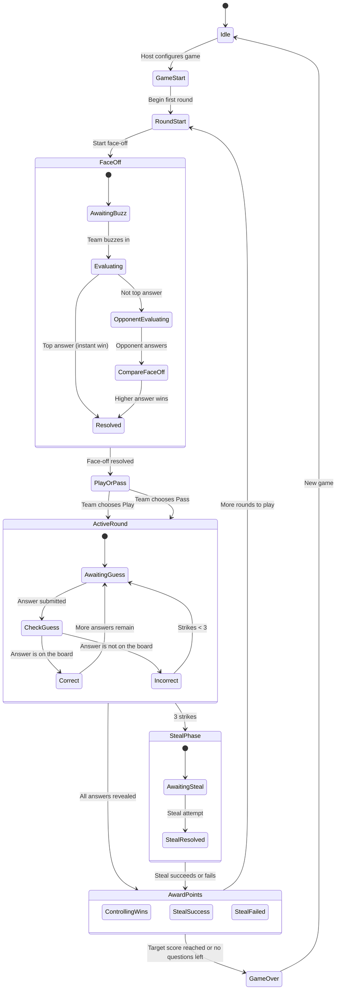

# Contention

**Contention** is a party game inspired by the classic *Family Feud* game show. Two teams go head-to-head, trying to guess the most popular answers to survey-style questions. Points are awarded for each correct answer, and the first team to reach the target score wins.

All you need is a computer, a browser, and a group of friends ready to argue over who gave the better answer.

## License

Contention is **free to use** for anyone who wants to have fun. It is released under the [MIT License](https://opensource.org/licenses/MIT), which means you can use, copy, modify, and share it however you like — no strings attached.

## How to Play

> Imagine you're sitting down with friends, splitting into two teams. One person takes on the role of the **host** (they'll run the admin panel), and everyone else gathers around the **game board** screen.

### Setup

Before the game begins, the host picks a set of questions, enters the two team names, and sets a target score (the default is 200 points). Once everything is ready, the game begins.

### The Face-Off

Each round starts with a **face-off**. The host reads the question out loud, and one player from each team races to buzz in first. The host records who buzzed in and what answer they gave.

- If the first player to buzz in nails the **number one answer**, their team immediately wins control of the round.
- If not, the opposing player gets a chance to answer. Whoever gave the higher-scoring answer wins control.

### Play or Pass

The team that won the face-off now has a choice: **play** or **pass**.

- **Play** means they keep control and will try to guess the remaining answers.
- **Pass** means they hand control to the other team, betting that the opponents will stumble.

### The Round

The controlling team takes turns guessing answers. Every correct answer reveals on the board and adds points to the **round pot**. But be careful — every wrong answer earns a **strike**.

- After **three strikes**, the round is over for that team, and the game moves to the steal phase.
- If the team manages to reveal **all the answers** before getting three strikes, they win the round pot outright.

### The Steal

When three strikes happen, the opposing team gets **one single chance** to steal all the points in the pot. They huddle up, agree on an answer, and give it to the host.

- If they guess a remaining answer correctly, they **steal the entire round pot**.
- If they miss, the controlling team keeps the points anyway.

### Scoring and Winning

After each round, the points from the pot are added to the winning team's total score. A new round begins with a fresh question.

The game ends when:

- A team reaches the **target score**, or
- All the selected questions have been played.

The team with the most points wins!

## Questions

Contention uses **YAML files** to define questions. Each file represents one survey question with its possible answers and point values. The questions live in the `questions/` folder at the root of the project.

### How to Add a Question

1. Create a new `.yaml` file in the `questions/` folder. Name it something descriptive (e.g., `breakfast-foods.yaml`).
2. Follow the format below.
3. Restart the server — questions are loaded automatically at startup.

### Format and Schema

Each question file must follow this structure:

| Field | Type | Description |
|---|---|---|
| `question` | string | The survey question displayed to players. |
| `types` | list of strings | Categories or tags for the question (used for filtering in the admin panel). |
| `responses` | list of objects | The possible answers. Each has an `answer` (string) and a `value` (number representing points). |

Answers should be ordered from **highest value to lowest**. The values represent how popular each answer is — the most popular answer gets the most points.

### Example Question File

Below is a complete example. Save this as a `.yaml` file inside the `questions/` folder:

```yaml
question: "Name a popular pizza topping"
types:
  - food
  - easy
responses:
  - answer: "Pepperoni"
    value: 42
  - answer: "Cheese (Extra)"
    value: 25
  - answer: "Mushrooms"
    value: 15
  - answer: "Sausage"
    value: 10
  - answer: "Peppers"
    value: 5
  - answer: "Onions"
    value: 3
```

## The Two Screens

Contention is designed to run on **two browser windows** (or two screens) at the same time:

### Admin Panel (`/admin`)

This is the **host's control center**. Only the host should see this screen. From here, the host can:

- Select which questions to use in the game
- Enter team names and set the target score
- Control the entire game flow: who buzzed in, what they answered, whether it's correct or not
- Advance through face-offs, play/pass decisions, rounds, steals, and scoring
- Reset the game at any time

Think of this as the host's clipboard — it's where all the behind-the-scenes decisions happen.

### Game Board (`/game`)

This is the **public screen** that everyone watches. It shows:

- The current question
- The answer board with hidden and revealed answers
- Team names and scores
- The round pot (how many points are up for grabs)
- Strike indicators (those big red X marks)
- Victory celebrations when the game ends

Point this screen at a TV, projector, or shared display so both teams and the audience can follow along.

### One Game at a Time

Contention supports **one active game at a time**. The admin panel and game board are synchronized in real-time — there is no concept of multiple game rooms or lobbies. If you want to start a new game, the host simply resets from the admin panel.

---

## Technical Documentation

Everything below is for developers who want to install, run, or modify Contention.

### Installation

**Prerequisites:**

- Node.js 18 or higher
- npm (comes with Node.js)

**Steps:**

1. Clone the repository and navigate into it:

```bash
cd contention
```

2. Install dependencies:

```bash
npm install
```

3. Start the development server:

```bash
npm run dev
```

4. Open two browser tabs:
   - **Admin Panel**: [http://localhost:3003/admin](http://localhost:3003/admin)
   - **Game Board**: [http://localhost:3003/game](http://localhost:3003/game)

**Production build:**

```bash
npm run build
npm start
```

### Tech Stack

| Technology | Purpose |
|---|---|
| **Next.js 14** | React framework with App Router for the frontend |
| **React 18** | UI rendering |
| **Mantine v7** | UI component library (dark theme, layout, controls) |
| **XState v5** | State machine that drives all game logic |
| **Socket.IO** | Real-time communication between admin, server, and game board |
| **TypeScript** | Type safety across the codebase |
| **js-yaml** | Parsing YAML question files on the server |

The application runs on a custom server (`server.ts`) that combines Next.js with a Socket.IO server, both on port 3003.

### State Machine

All game logic is powered by a finite state machine built with XState v5, located in `src/machines/gameMachine.ts`. The machine manages every phase of the game, from setup to game over, ensuring the game always moves through valid transitions.

#### States

| State | Description |
|---|---|
| **Idle** | No game is active. Waiting for the host to configure a new game. |
| **Game Start** | Game has been configured. Waiting for the host to begin the first round. |
| **Round Start** | A new round is being initialized. The board resets for a fresh question. |
| **Face-Off** | Two players compete to win control. Contains sub-states: waiting for a buzz-in, evaluating the first answer, evaluating the opponent's answer, and comparing results. |
| **Play or Pass** | The face-off winner decides whether to play (keep control) or pass (give control to the opponent). |
| **Active Round** | The controlling team guesses answers. Contains sub-states for submitting guesses, handling correct answers, and handling strikes. |
| **Steal Phase** | Triggered after 3 strikes. The opposing team gets one chance to guess a remaining answer and steal the pot. |
| **Award Points** | Points from the round pot are awarded to the winning team. Determines if it was a clean win, a successful steal, or a failed steal. |
| **Game Over** | A team has reached the target score or all questions have been played. The winner is displayed. |

#### Flow Diagram



#### Key Rules Enforced by the Machine

- A face-off must happen before any team can play a round.
- The face-off winner always gets the play-or-pass decision.
- A maximum of 3 strikes per round before the steal phase triggers.
- The steal team gets exactly one attempt — no second chances.
- The game ends when a team reaches the target score or when all questions have been used.
- A new game can only start after the current one ends or is reset.
